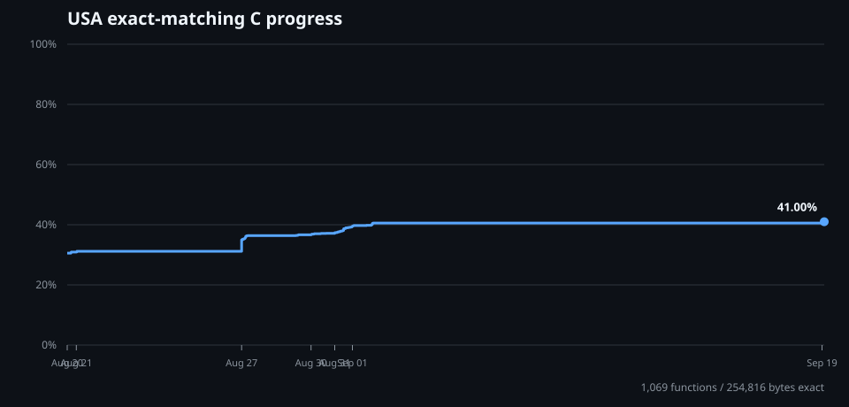

# podcruise

`podcruise` is a clean-room, multi-version decompilation project for the
Nintendo 64 release of *Star Wars Episode I: Racer*.

USA retail is the canonical matching target. Japan, Europe, and the later USA
revision are independent build targets and structural evidence for the shared
source tree. Shifted functions, changed constants, and localized data help
distinguish code boundaries from data and relocation artifacts.

**This project does not condone piracy.** *Star Wars Episode I: Racer* is a
copyrighted work; this repository claims no rights in it, is not affiliated with
or endorsed by any rightsholder, and distributes no part of it. See
`docs/IP_POLICY.md` for the full position and its limits.

This repository contains no ROM data, and none of its tooling will obtain any.
Verification requires retail images that you already lawfully possess; every
recognized ROM extension is Git-ignored so that none can be committed by
accident. Nothing in this project describes how to acquire the game, and it is
not a substitute for owning it.

## Current state

- Four unique retail builds inventoried by cryptographic hash: USA, Japan,
  Europe, and the later USA revision.
- Reproducible N64 header and cryptographic-hash inventory.
- Independent MIPS function-candidate discovery from entry points, `jal`
  targets, and stack-frame prologues.
- Relocation-tolerant normalized-window mapping from USA functions into the
  Japan and Europe executables.
- `splat` configurations for all four unique supplied images, without
  committing extracted code or assets.
- Byte-identical hybrid rebuilds for all four unique images.
- 1,348 functions represented by independently written C, covering 616,976
  original instruction bytes. `make manifest` generates that ledger into
  `analysis/source_manifest.json` from the matching configuration and the
  per-version comparison reports, and fails if any recovered source is left
  unmeasured.
- Exact IDO 5.3 matches for 1,035 of them (242,324 bytes) in the canonical USA
  image. The current regional reports contain 893 matches (196,460 bytes) for
  Japan, 894 (204,584 bytes) for Europe, and 1,035 (242,324 bytes) for the later
  USA revision. The remaining reviewed candidates are behavior-recovered but
  not yet byte-matching; see [`docs/DECOMP_STATUS.md`](docs/DECOMP_STATUS.md)
  for the precise terminology and current ledger.

This is the beginning of a source-matching decompilation, not a claim that the
game is already decompiled or playable.



The chart tracks exact USA matching-C coverage only. Its
[milestone data](docs/decomp_progress.tsv) is regenerated from Git history with
`make progress-chart`; [function token measurements](docs/function_token_log.tsv)
are logged separately when the runtime exposes defensible usage totals.

## Quick start

```sh
make inventory
make analyze
make map
make test
```

To install and run `splat` in the project-local environment:

```sh
make setup
make match-c
make roundtrip-all
```

`roundtrip-all` compiles and substitutes each build's verified C tranche, links
the remaining local assembly and opaque data, and requires byte identity with
all four unique validated inputs. The three third-party filenames are identical
aliases, so one LRG revision build covers the same bytes in all three files.

Generated assembly, extracted assets, build output, caches, and ROMs stay
untracked, and so does everything under `analysis/`. Those reports are derived
from local ROM images and are reproducible on any machine that has the inputs,
so they are generated by `make` rather than committed.

## ROM placement

The local working copy expects the exact paths listed in
[`config/versions.json`](config/versions.json). Run `make inventory` to verify
them. See [`roms/README.md`](roms/README.md) for the expected files and hashes.

## Strategy

USA retail is the canonical matching target because it is the earliest supplied
retail build. Other versions are separate targets, not patches to be blindly
merged. Work proceeds in this order:

1. establish exact ROM identity and segment boundaries;
2. derive and verify function boundaries across versions;
3. identify compiler, SDK, library, and overlay behavior;
4. split code/data with `splat` and preserve a matching-ROM build loop;
5. replace assembly one function at a time with matching C;
6. expand shared and version-specific source across every supplied build.

The detailed plan and evidence policy are in
[`docs/ROADMAP.md`](docs/ROADMAP.md).
Progress terminology is defined in
[`docs/DECOMP_STATUS.md`](docs/DECOMP_STATUS.md).
The installed-versus-distributed tool boundary and current license audit are in
[`docs/TOOLCHAIN.md`](docs/TOOLCHAIN.md).

## IP-safety boundary

The repository follows the conservative clean-room policy in
[`docs/IP_POLICY.md`](docs/IP_POLICY.md). In short: Git may contain original
project tooling and compact factual observations, but not ROM bytes, extracted
assets, generated disassembly, proprietary SDK/compiler files, or source copied
from prior projects. Run `make safety` before every commit.

## Prior art

The separate [`sp00nznet/racer`](https://github.com/sp00nznet/racer) project
demonstrated that the USA binary can be statically recompiled far enough to
boot and submit display lists. It provides useful public observations, but it
is not a source decompilation and currently has no explicit license. No source
from that repository is copied here. See [`docs/PRIOR_ART.md`](docs/PRIOR_ART.md).

## Legal

No copyrighted ROM, extracted asset, or generated disassembly is intended for
Git history. The project is for interoperability, research, and preservation.
No affiliation with Lucasfilm, LucasArts, Nintendo, or Disney is implied.

This operational policy reduces avoidable IP exposure; it is not a legal
opinion or a guarantee about every jurisdiction or use.

## License

The independently authored Podcruise source, tools, and documentation are
available under the [MIT License](LICENSE). That license covers only rights
held by Podcruise contributors. It grants no rights to *Star Wars Episode I:
Racer*, its ROM, assets, or any other third-party material.
